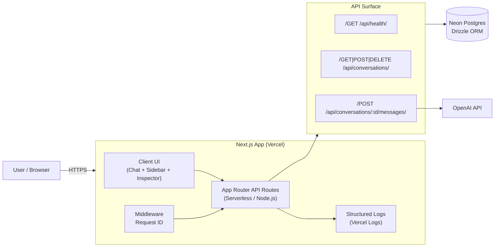

# Chatbot with Memory

Full-stack AI chatbot with persistent conversations, department-routed system prompts, and an Inspector for request-level debugging. Built for applied AI systems that require observability, prompt routing, and post-hoc analysis.

<p align="center">
  
  <br/>
  <sub><b>Main interface</b> — department agents + persistent conversations + Inspector drawer.</sub>
</p>

<table>
  <tr>
    <td align="center" width="50%">
      
      <br/>
      <sub><b>Agents</b> — route system prompts by department (Sales/Support/Engineering/Exec).</sub>
    </td>
    <td align="center" width="50%">
      
      <br/>
      <sub><b>Inspector</b> — request_id + latency + model + token usage for each response.</sub>
    </td>
  </tr>
  <tr>
    <td align="center" width="50%">
      
      <br/>
      <sub><b>Markdown</b> — clean GFM rendering with sanitization (lists, tables, code).</sub>
    </td>
    <td align="center" width="50%">
      
      <br/>
      <sub><b>Search & Filters</b> — fast client-side search + agent filter chips.</sub>
    </td>
  </tr>
</table>

## Why This Matters

- **Department Agents** → Prompt routing per org role. Each conversation uses a specialized system prompt (sales discovery, support troubleshooting, engineering tradeoffs).
- **Inspector** → Debuggability + request tracing. Every assistant response includes metadata (duration, model, tokens) correlated to server logs via `request_id`.
- **Persisted Metadata** → Post-hoc latency/cost visibility. All message metadata stored in PostgreSQL enables analysis of token usage, response times, and model performance over time.

## Demo (90 seconds)

1. Select a department agent (e.g., "Engineering") → Click "New Chat"
2. Send a message (e.g., "Explain tradeoffs of SSE vs WebSockets")
3. Click ⓘ icon on assistant response to open Inspector drawer
4. View metadata: duration, request ID, model, token usage
5. Correlate with Vercel logs using `request_id` from Inspector
6. Refresh page → conversation and metadata persist in database

## Features

- **Persistent Conversations**: All conversations and messages stored in Neon Postgres via Drizzle ORM
- **Department Agents**: 5 specialized agents (General, Sales, Support, Engineering, Executive) with custom system prompts, stored per conversation
- **Inspector Drawer**: Conversation tab (agent, system prompt, message count) and Message tab (duration, request ID, model, token usage)
- **Request Tracing**: Every API request includes `X-Request-ID` header; structured JSON logs with `request_id`, `method`, `path`, `status`, `duration_ms`
- **Persisted Metadata**: Message metadata (durationMs, requestId, model, usage) stored in `messages.meta` JSONB column
- **Markdown Rendering**: Assistant messages render markdown (lists, bold, code blocks) with HTML sanitization
- **Search & Filters**: Client-side search by title; agent filter chips
- **Command Palette**: Cmd+K / Ctrl+K for quick actions (New Chat, Focus Composer, Switch Agent, Clear All)

## Architecture



**Tech Stack**: Next.js App Router (TypeScript), Neon Postgres, Drizzle ORM, OpenAI API, Vercel (deployment), JSON logs + request_id (observability)

## Quickstart

```bash
cp .env.example .env
# Edit .env with DATABASE_URL and OPENAI_API_KEY

npm install
npm run db:push
npm run dev
```

Open [http://localhost:3000](http://localhost:3000)

### Environment Variables

- `DATABASE_URL` - Neon PostgreSQL connection string
- `OPENAI_API_KEY` - OpenAI API key

## Deploy (Vercel)

1. Push to GitHub and import in Vercel
2. Set environment variables: `DATABASE_URL`, `OPENAI_API_KEY`
3. Deploy (API routes use `runtime = "nodejs"`)
4. Run schema migrations: `vercel env pull .env.production.local --environment=production && export $(grep "^DATABASE_URL=" .env.production.local | xargs) && npm run db:push`

## API

- `GET /api/health` - Health check with DB connectivity
- `POST /api/conversations` - Create conversation (optional `agent_id`)
- `GET /api/conversations` - List all conversations
- `GET /api/conversations/:id` - Get conversation with messages
- `POST /api/conversations/:id/messages` - Send message + get AI response
- `DELETE /api/conversations/:id` - Delete conversation
- `DELETE /api/conversations` - Clear all conversations

All responses include `X-Request-ID` header. Structured logs include `request_id`, `method`, `path`, `status`, `duration_ms`.

## Development

```bash
npm run typecheck  # TypeScript validation
npm run lint       # ESLint
npm run build      # Production build
npm run smoke      # End-to-end smoke tests
npm run verify:secrets  # Scan for accidental secret commits
```

## License

MIT
