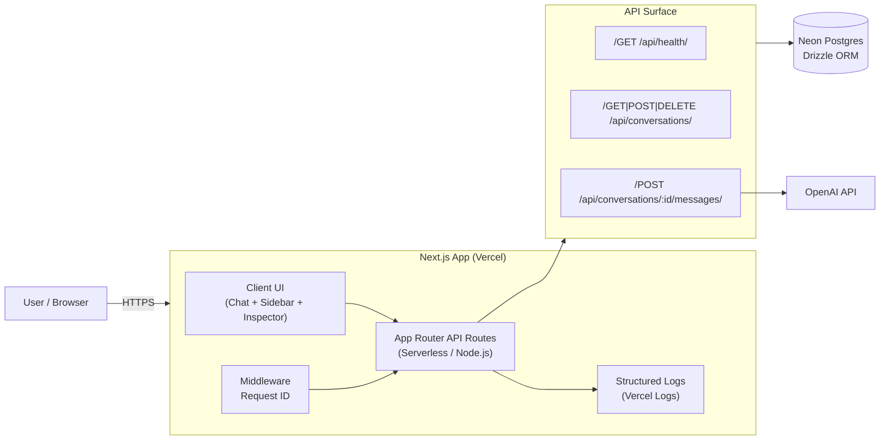

# Chatbot with Memory

A production-ready conversational AI application with persistent memory, department agents, and request tracing. Built for applied AI systems that require observability, prompt routing, and post-hoc analysis.


## Screenshots


**Key Features:**

- **Department Agents**: Select specialized agents for different roles
  

- **Markdown Rendering**: Assistant messages render lists, code blocks, and formatting
  

- **Inspector Panel**: Debug metadata including request ID, duration, model, and token usage
  

- **Search & Filters**: Find conversations quickly with search and agent filters
  

## Quickstart

```bash
cp .env.example .env
# Edit .env with DATABASE_URL and OPENAI_API_KEY

npm install
npm run db:push
npm run dev
```

Open [http://localhost:3000](http://localhost:3000)

## Demo Walkthrough (90 seconds)

1. Select a department agent (e.g., "Engineering") → Click "New Chat"
2. Send a message (e.g., "Explain tradeoffs of SSE vs WebSockets")
3. Click ⓘ icon on assistant response to open Inspector drawer
4. View metadata: duration, request ID, model, token usage
5. Correlate with Vercel logs using `request_id` from Inspector
6. Switch agents to see different system prompts and response styles

## Why This Matters

**Department Agents** → Prompt routing for org roles. Each agent uses a specialized system prompt optimized for their domain (sales discovery, support troubleshooting, engineering tradeoffs).

**Inspector** → Debuggability + request_id correlation. Every assistant response includes metadata (duration, model, tokens) that can be traced back to Vercel logs via `request_id` for production debugging.

**Postgres Persistence** → Auditability + post-hoc analysis. All message metadata is stored in PostgreSQL, enabling analysis of token usage, response times, and model performance over time.

## Architecture



**Tech Stack**: Vercel (deployment), Next.js App Router (framework), Neon Postgres (database), Drizzle ORM (queries), OpenAI API (LLM), JSON logs + request_id (observability)

## Operational Notes

**Vercel Logs**: Dashboard → Project → Logs. Search by `request_id` from `X-Request-ID` header for request correlation.

**Schema Changes**: After deployment, apply to production:
```bash
vercel env pull .env.production.local --environment=production
export $(grep "^DATABASE_URL=" .env.production.local | xargs)
npm run db:push
```

**Request Tracing**: All API responses include `X-Request-ID` header. Structured logs include `request_id`, `method`, `path`, `status`, `duration_ms`.

## API

- `GET /api/health` - Health check with DB connectivity
- `POST /api/conversations` - Create conversation (optional `agent_id`)
- `GET /api/conversations` - List all conversations
- `GET /api/conversations/:id` - Get conversation with messages
- `POST /api/conversations/:id/messages` - Send message + get AI response
- `DELETE /api/conversations/:id` - Delete conversation
- `DELETE /api/conversations` - Clear all conversations

## Development

```bash
npm run typecheck  # TypeScript validation
npm run lint       # ESLint
npm run build      # Production build
npm run smoke      # End-to-end smoke tests
npm run verify:secrets  # Scan for accidental secret commits
```

## License

MIT
