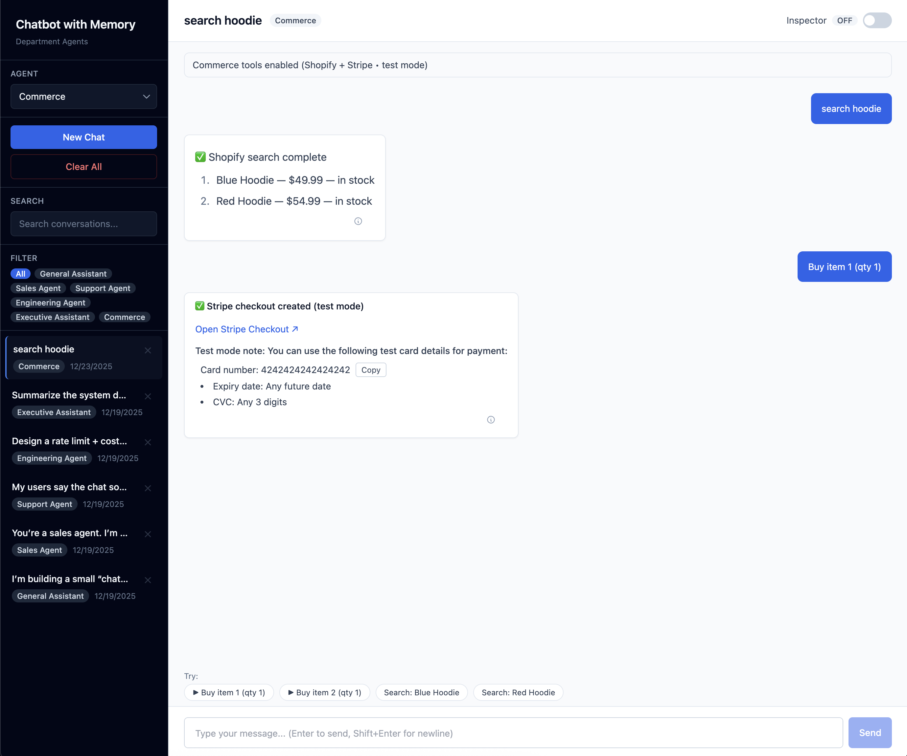
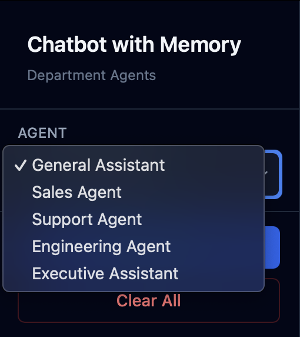
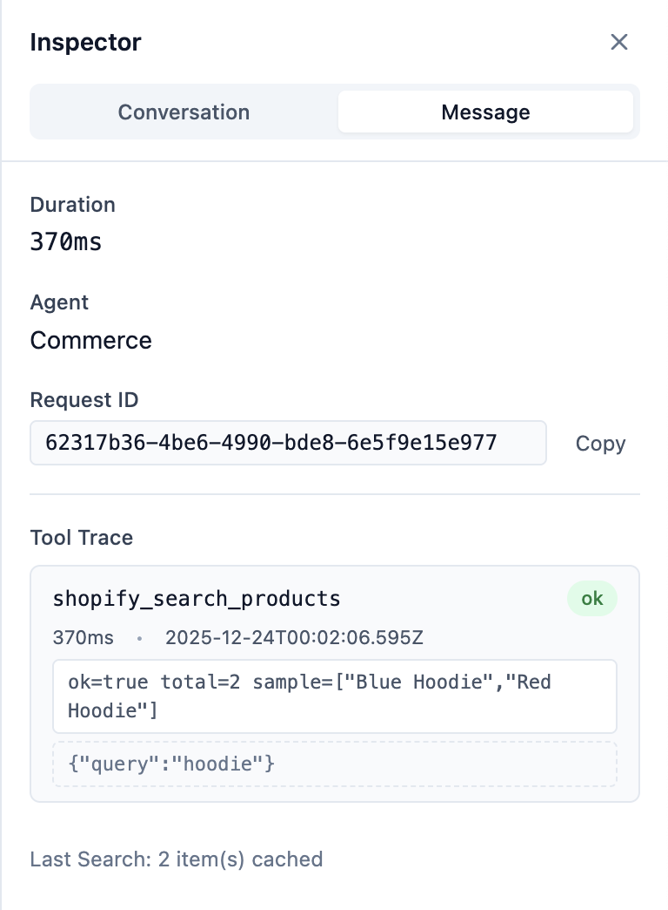
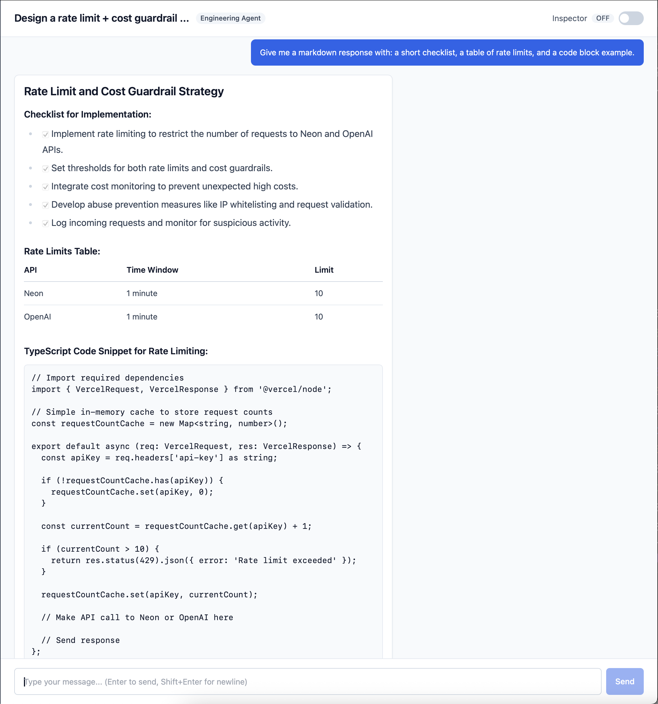
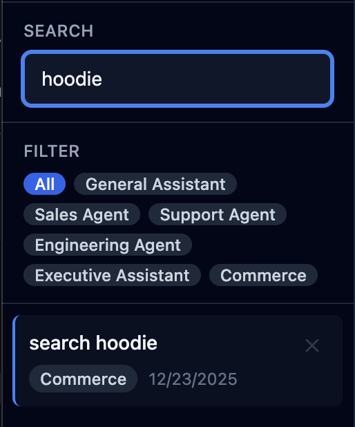
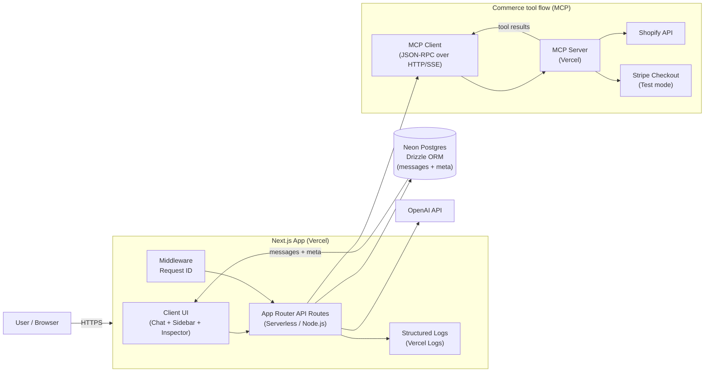

# Chatbot with Memory

Full-stack AI chatbot with persistent conversations, multi-agent routing, and request-level debugging via Inspector. Built for applied AI systems requiring observability, prompt routing, and post-hoc analysis.

**Live demo:** [chatbot-with-memory-ochre.vercel.app](https://chatbot-with-memory-ochre.vercel.app)

## Highlights

- **Multi-Agent Routing** — Prompt routing per conversation by role (Sales/Support/Engineering/Executive)
- **Commerce Agent (MCP Tools)** — Shopify product search + Stripe Checkout (test mode) via MCP, with tool trace captured per message in Inspector. MCP server: https://mcp-partner-integration-demo.vercel.app
- **Persistent Memory** — Postgres-backed conversations and message history
- **Inspector Drawer** — Request ID, latency, model, and token usage per response
- **Structured Logging** — Request tracing with `request_id` correlation to Vercel logs
- **Markdown Rendering** — GFM support with HTML sanitization for assistant messages

<p align="center">
  
  <br/>
  <sub><b>Main interface</b> — multi-agent routing + persistent conversations + Inspector drawer.</sub>
</p>

<table>
  <tr>
    <td align="center" width="50%">
      
      <br/>
      <sub><b>Agents</b> — route system prompts by role (Sales/Support/Engineering/Executive).</sub>
    </td>
    <td align="center" width="50%">
      
      <br/>
      <sub><b>Inspector</b> — request_id + latency + model + token usage for each response.</sub>
    </td>
  </tr>
  <tr>
    <td align="center" width="50%">
      
      <br/>
      <sub><b>Markdown</b> — clean GFM rendering with sanitization (lists, tables, code).</sub>
    </td>
    <td align="center" width="50%">
      
      <br/>
      <sub><b>Search & Filters</b> — fast client-side search + agent filter chips.</sub>
    </td>
  </tr>
</table>

<p align="center"><sub>Tip: Cmd/Ctrl+K opens the command palette</sub></p>

## Why This Matters

- **Multi-Agent Routing** → Prompt routing per org role enables specialized responses (sales discovery, support troubleshooting, engineering tradeoffs)
- **Inspector** → Request tracing via `request_id` enables production debugging and latency analysis
- **Persisted Metadata** → Post-hoc analysis of token usage, response times, and model performance over time

## Demo (90 seconds)

1. Select "Engineering" agent → Click "New Chat"
2. Send message: "Explain tradeoffs of SSE vs WebSockets"
3. Click ⓘ icon on assistant response → Inspector opens
4. View metadata: duration, request ID, model, token usage
5. Refresh page → conversation and metadata persist
6. Press Cmd/Ctrl+K → command palette opens

## Architecture



**Tech Stack:**
- Next.js App Router (TypeScript)
- Neon Postgres
- Drizzle ORM
- OpenAI API
- Vercel (deployment)
- Request ID middleware + structured logs

## Quickstart

```bash
cp .env.example .env
# Edit .env: DATABASE_URL, OPENAI_API_KEY
# Note: Copy .env.example → .env (never commit .env)

npm install
npm run db:push
npm run dev
```

Open [http://localhost:3000](http://localhost:3000)

**Troubleshooting:** If `db:push` fails, verify `DATABASE_URL` uses Neon pooler URL (`?sslmode=require`).

## Commerce (MCP) demo

- Env: set `COMMERCE_ENABLED=true` and `MCP_SERVER_URL` to your MCP server URL (if it lacks `/mcp`, the client appends it).
- MCP server: https://mcp-partner-integration-demo.vercel.app (the client appends /mcp if missing)
- Script:
  1. Select Commerce agent.
  2. Send: `search hoodies under $80`.
  3. Click: `▶ Buy item 1 (qty 1)`.
  4. Complete Stripe test payment → redirect back shows the success banner.
  5. Open Inspector → Tool Trace + `request_id`.

## Deploy (Vercel)

1. Push to GitHub and import in Vercel
2. Set environment variables: `DATABASE_URL`, `OPENAI_API_KEY`
3. Deploy (API routes use `runtime = "nodejs"`)
4. Run migrations:
   ```bash
   vercel env pull .env.production.local --environment=production
   export $(grep "^DATABASE_URL=" .env.production.local | xargs)
   npm run db:push
   ```

## Observability

- **Request ID**: Generated by middleware, included in `X-Request-ID` response header
- **Inspector**: View `request_id`, `durationMs`, `model`, and `usage` per assistant message
- **Vercel Logs**: Search by `request_id` in Dashboard → Project → Logs
- **Persisted Metadata**: Stored in `messages.meta` JSONB column (durationMs, requestId, agentId, model, usage)

## API

- `GET /api/health` - Health check with DB connectivity
- `POST /api/conversations` - Create conversation (optional `agent_id`)
- `GET /api/conversations` - List all conversations
- `GET /api/conversations/:id` - Get conversation with messages
- `POST /api/conversations/:id/messages` - Send message + get AI response
- `DELETE /api/conversations/:id` - Delete conversation
- `DELETE /api/conversations` - Clear all conversations

All responses include `X-Request-ID` header.

## Security

- `.env` files are gitignored
- Run `npm run verify:secrets` to scan for accidental secret commits
- Never commit API keys or database URLs

## Development

```bash
npm run typecheck  # TypeScript validation
npm run lint       # ESLint
npm run build      # Production build
npm run smoke      # End-to-end smoke tests
```

## License

MIT
